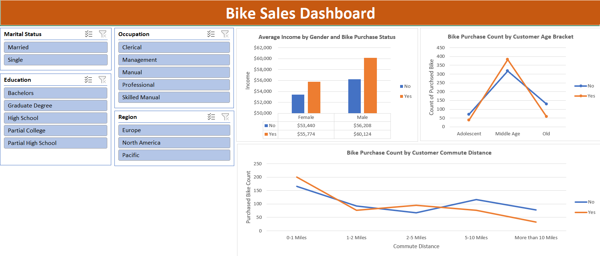

# Analyzing Bike Purchase Behavior with Excel 

## Introduction

This project demonstrates **Data Cleaning and Dashboard Creation in Excel**. Using the **Bike Buyers dataset**, I transformed raw survey data into a clean, structured format and built an **interactive dashboard**. The dashboard analyzes **bike purchase behavior** across demographics and commute patterns, enhanced with slicers for dynamic filtering.

---

## Background

The dataset contains customer information such as **demographics, income, commute habits, and purchase decisions**. The main objective was to understand **which factors influence bike purchases** and to present insights through a clear and interactive Excel dashboard.

### The questions I aimed to answer were:

1. Does **income** vary significantly between those who purchased bikes and those who didn’t?
2. Which **age groups** are most likely to purchase bikes?
3. How does **commute distance** impact bike buying decisions?
4. Do demographic factors like (marital status, gender, education, region, occupation) affect purchase behavior?

---

## Tools I Used

For this project, I utilized:

* **Microsoft Excel:** For data cleaning, pivot tables, and dashboard creation.
* **Pivot Tables & Charts:** To analyze income, age groups, and commute distances.
* **Slicers:** For interactive filtering by marital status, education, occupation, and region.

---

## The Analysis

### 1. Data Cleaning

The dataset initially contained inconsistencies. I performed the following cleaning steps:

* **Removed duplicates** to avoid skewed results.
* **Standardized categorical values:**

  * Changed `M` / `S` → **Married / Single** (Marital Status).
  * Changed `F` / `M` → **Female / Male** (Gender).
* **Created Age Brackets:** Converted numeric ages (e.g., 42, 36, 54) into categories:

  * **Adolescent (<31)**
  * **Middle Age (31–54)**
  * **Old (>54)**
  * Formula used:

    ```excel
    =IF(L2>54,"Old",IF(L2>=31,"Middle Age",IF(L2<31,"Adolescent","Invalid")))
    ```

---

### 2. Pivot Tables

I created multiple pivot tables to explore purchase patterns:

**a. Average Income by Gender and Purchase Status**

* Males and females who purchased bikes had **higher average incomes** than those who didn’t.
* Male buyers had the highest average income at **$60,124**.

**b. Bike Purchases by Commute Distance**

* Short commutes (0–1 miles) showed the **highest bike purchases (200)**.
* Purchases decreased as commute distance increased, with **long-distance commuters (>10 miles)** least likely to buy bikes.

**c. Bike Purchases by Age Bracket**

* **Middle-aged customers** were the most likely to purchase bikes.
* Adolescents and older individuals were less likely to buy bikes.

---

### 3. Dashboard Creation

Using the cleaned dataset and pivot tables, I built an **interactive dashboard** with:

* **Income vs Purchase status by gender** (bar chart).
* **Bike purchases by age bracket** (line chart).
* **Bike purchases by commute distance** (line chart).
* **Slicers** for marital status, education, occupation, and region to allow dynamic filtering.
  



---

## What I Learned

* Practical skills in **data cleaning and transformation in Excel**.
* How to use **pivot tables** effectively for categorical and numerical analysis.
* The importance of **data visualization** in uncovering customer purchase behavior.
* Building **interactive dashboards with slicers** for user-friendly insights.

---

## Conclusions

### Insights

1. **Income matters:** Customers with higher incomes are more likely to purchase bikes.
2. **Middle-aged customers** are the prime target group for bike sales.
3. **Commute distance impacts decisions:** Those with shorter commutes purchase more bikes.
4. **Dashboard interactivity** allows filtering by demographics to uncover further trends.

### Closing Thoughts

This project highlights the power of Excel in combining **data cleaning, pivot analysis, and visualization** into a single interactive dashboard. The insights can help businesses **identify target markets and tailor marketing strategies** to boost bike sales.

---


