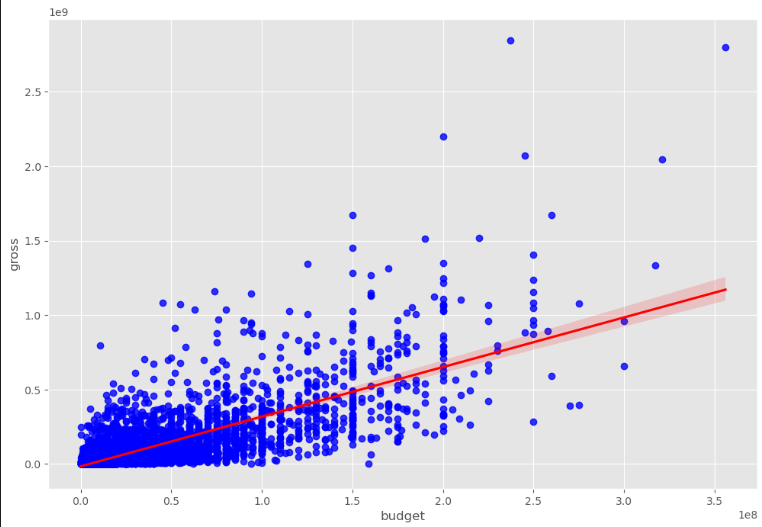
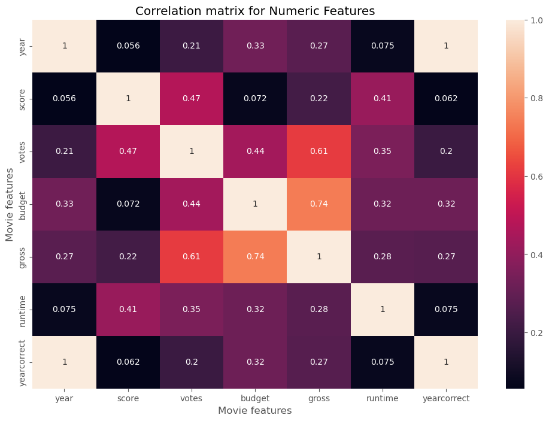
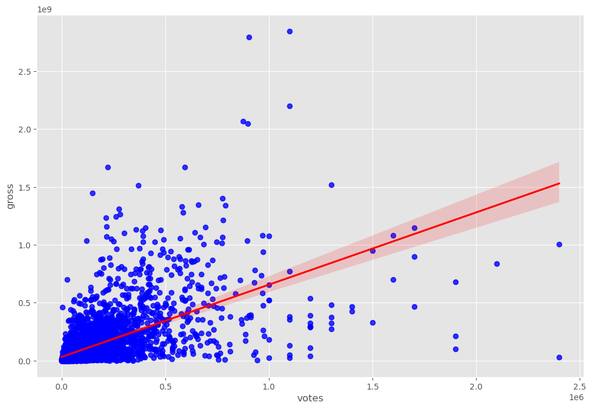
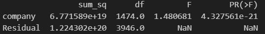

# Movie Correlation Analysis

## Introduction

Exploring the film industry with Python! This project leverages Python libraries to identify **influential variables affecting the gross earnings of movies**. By analyzing factors like budget, votes, production company, we uncover patterns that drive box office success. 

Python code? Check them out here: [Python folder](/Pyhton/Movie_Correlation_PortfolioProject.ipynb).

---

## Background

This project was created to understand **what drives the financial success of movies**. By cleaning, exploring, and analyzing movie datasets, the aim is to pinpoint key factors that correlate with higher gross earnings. The dataset includes variables such as movie title, budget, gross earnings, release year, votes, runtime, and production company.

### The questions I wanted to answer through Python analysis were:

1. How does the **budget** of a movie correlate with its gross earnings?
2. How does the **votes** correlate with gross earnings?
3. If production company has a significant effect on gross earnings or not.

---

## Tools I Used

For this analysis, I leveraged the following tools:

* **Python:** Core programming language for data cleaning, exploration, and statistical analysis.
* **Pandas & NumPy:** For data manipulation, cleaning, and calculations.
* **Matplotlib & Seaborn:** For visualizing correlations, scatter plots, regression lines.
* **Statsmodels:** For performing ANOVA to assess company influence on gross earnings.
* **Jupyter Notebook:** Primary environment to run Python scripts and generate visualizations.

---

## The Analysis

Each step of the Python code was aimed at cleaning, exploring, or analyzing different aspects of the movie dataset. Here’s a breakdown:

---

### 1. Data Cleaning & Preparation

* Checked for missing values and removed incomplete records.
* Converted `budget` and `gross` columns to integers.
* Extracted correct release year from the `released` column.
* Removed duplicate rows to ensure clean analysis.

```python
df['budget'] = df['budget'].astype('int64')
df['gross'] = df['gross'].astype('int64')
df['yearcorrect'] = df['released'].str.extract(pat='([0-9]{4})').astype(int)
df.drop_duplicates(inplace=True)
```

---

### 2. Exploring Budget vs Gross

* Plotted scatter plots and regression lines to visualize the relationship between **budget and gross earnings**.
* Observed a strong positive correlation.

```python
sns.regplot(x="budget", y="gross", data=df, scatter_kws={"color": "blue"}, line_kws={"color": "red"})
```




---

### 3. Correlation Analysis

* Calculated **Pearson correlation** among numeric features.
* Created a heatmap to visualize correlations.

```python
correlation_matrix = df.corr(method='pearson', numeric_only=True)
sns.heatmap(correlation_matrix, annot=True)
plt.title("Correlation Matrix for Numeric Features")
plt.show()
```




**Key Insight:** Budget and gross earnings showed a high correlation (≈0.74), indicating budget is a major driver of box office success. 

---

### 4. Votes vs Gross

* Plotted scatter plots and regression lines for **votes vs gross**.
* Verified moderate positive correlation.

```python
sns.regplot(x="votes", y="gross", data=df, scatter_kws={"color": "blue"}, line_kws={"color": "red"})
```




**Key Insight:** Votes showed a moderate correlation with gross (≈0.61), suggesting votes also have some influence on box office success.

---

### 5. Statistical Testing (ANOVA)

* Tested if production company has a significant effect on gross earnings.

```python
import statsmodels.api as sm
from statsmodels.formula.api import ols

model = ols('gross ~ company', data=df).fit()
anova_table = sm.stats.anova_lm(model, typ=2)
print(anova_table)
```




**Key Insight:** Company has a statistically significant effect on box office gross. However, the effect size is modest (F = 1.48), suggesting that while studio affiliation matters, it’s not the dominant driver of revenue. The significance is amplified by a large sample size, indicating that subtle differences between studios become detectable at scale.

---

## What I Learned

Through this project, I gained hands-on experience with **Python for data analysis and visualization**. Key takeaways include:

* **Data cleaning and preprocessing:** Handling missing values, converting types, extracting information from text.
* **Correlation and regression analysis:** Identifying relationships between numeric features and target variables.
* **Visualization:** Using scatter plots, regression lines, and heatmaps to uncover insights.
* **Statistical analysis with ANOVA:** Assessing the influence of categorical factors on numeric outcomes.

---

## Conclusions

### Insights

1. **Budget is a strong predictor of gross earnings**: Higher budgets tend to correlate with higher gross revenue.
2. **Votes have moderate influence**: Popularity can partly predict financial success.
3. **Company matters**: Yes - the company that makes a movie does have an impact on how much money it earns. But the effect is not very strong. The result is statistically significant because we have a large number of movies, which makes even small differences noticeable. So while studio choice matters, it’s not the main reason a movie earns more or less.

### Closing Thoughts

This project allowed me to **merge Python programming, statistical analysis, and visualization skills** to uncover actionable insights from movie datasets. The combination of correlation analysis, various visualization, and ANOVA testing highlights how data can inform creative and business decisions in the film industry.

---


