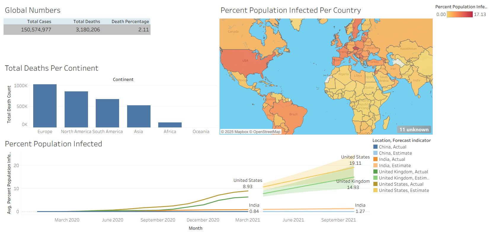

# COVID-19 Tableau Dashboard

Dive deeper into the global impact of the COVID-19 pandemic through interactive visualizations!
This project builds on my SQL-based analysis of COVID-19 data by creating a Tableau dashboard that highlights key metrics such as global cases, deaths, infection percentages, and population-level impacts. It also incorporates Tableau’s forecasting capability to estimate future infection trends based on historical data.

🔗 SQL analysis project: [COVID-19 Data Exploration](/Tableau/Covid_Project)

👉 Explore the dashboard here: [COVID-19 Tableau Dashboard](https://public.tableau.com/app/profile/swarnali.banerjee/viz/Covid_Data_Dashboard_17587963546020/Dashboard1)

---

# Background

After exploring COVID-19 data using SQL, I wanted to transform the insights into a more **visual, interactive format** for storytelling and accessibility. Tableau was the perfect tool to bring raw numbers to life, allowing patterns, comparisons, and trends to be immediately understood through visuals.

The dataset contains information on COVID-19 cases, deaths, and populations across countries and continents.

This dashboard visualizes how the pandemic unfolded globally, comparing regions and highlighting both infection and mortality patterns.

---

# Tools I Used

* **Tableau Public:** For building the interactive dashboard and visual storytelling.
* **SQL Server Management Studio (SSMS):** Data cleaning and preparation through queries.
* **Git & GitHub:** Version control and project sharing.

---

# Queries Behind the Dashboard

Only specific SQL queries from the original project were used to prepare data for Tableau:

### 1. Global Totals

```sql
Select SUM(new_cases) as total_cases, 
       SUM(cast(new_deaths as int)) as total_deaths, 
       SUM(cast(new_deaths as int))/SUM(New_Cases)*100 as DeathPercentage
From Portfolio_Project_SQL..CovidDeaths
where continent is not null
```

### 2. Total Deaths by Continent

```sql
Select location, SUM(cast(new_deaths as int)) as TotalDeathCount
From Portfolio_Project_SQL..CovidDeaths
Where continent is null 
  and location not in ('World', 'European Union', 'International')
Group by location
order by TotalDeathCount desc
```

### 3. Countries with Highest Infection Rates

```sql
Select Location, Population, 
       MAX(total_cases) as HighestInfectionCount,  
       Max((total_cases/population))*100 as PercentPopulationInfected
From Portfolio_Project_SQL..CovidDeaths
Group by Location, Population
order by PercentPopulationInfected desc
```

### 4. Percent Population Infected Over Time

```sql
Select Location, Population, date, 
       MAX(total_cases) as HighestInfectionCount,  
       Max((total_cases/population))*100 as PercentPopulationInfected
From Portfolio_Project_SQL..CovidDeaths
Group by Location, Population, date
order by PercentPopulationInfected desc
```

---

# The Dashboard



The dashboard provides:

1. **Global Numbers** *(Text Table)* – Total cases, deaths, and global mortality percentage.
2. **Total Deaths Per Continent** *(Bar Chart)* – Highlights how regions compare in terms of total death counts.
3. **Percent Population Infected Per Country** *(Map View)* – A geographic visualization of infection percentages.
4. **Percent Population Infected (Trend Over Time)** *(Line Chart with Forecast)* – Tracks how infection percentages evolved in selected countries (**China, India, the United Kingdom, and the United States**). This chart includes both actual and forecasted data, using Tableau’s forecasting tool to estimate future infection percentages through September 2021.

---

# Key Insights

1. **Infection & Mortality Patterns:** While the global mortality percentage was ~2.1%, absolute deaths were concentrated in Europe and the Americas, reflecting both population density and outbreak severity.
2. **Regional Trends:** Europe recorded the highest total deaths, followed closely by North and South America.
3. **Country-Level Impact:** Smaller nations like Andorra and San Marino had some of the highest infection percentages relative to population, whereas large nations like the US showed high absolute numbers.
4. **Temporal Patterns:** Forecasted trends suggested infection percentages rising gradually for countries like the US and UK during 2020–2021, compared to slower growth in India, while China showed minimal infection - both actual and estimated.
---

# What I Learned

* How to transition from raw SQL outputs to an interactive visualization tool like Tableau.
* The importance of **storytelling in analytics**, using visuals to highlight trends hidden in numbers.
* Hands-on practice combining **SQL for backend analysis** with **Tableau for frontend insights**.
* Better appreciation for how the **same dataset** can serve very different purposes depending on how it’s presented.
* How to apply Tableau’s forecasting tool to extend historical data into future projections, enhancing the analytical depth of time-series visualizations.

---

# Conclusions

This Tableau dashboard complements my SQL COVID-19 project by transforming query results into **accessible, visual insights**. While SQL was essential for preparing and aggregating the data, Tableau turned those results into an interactive story of the pandemic’s impact on different regions of the world.

---
